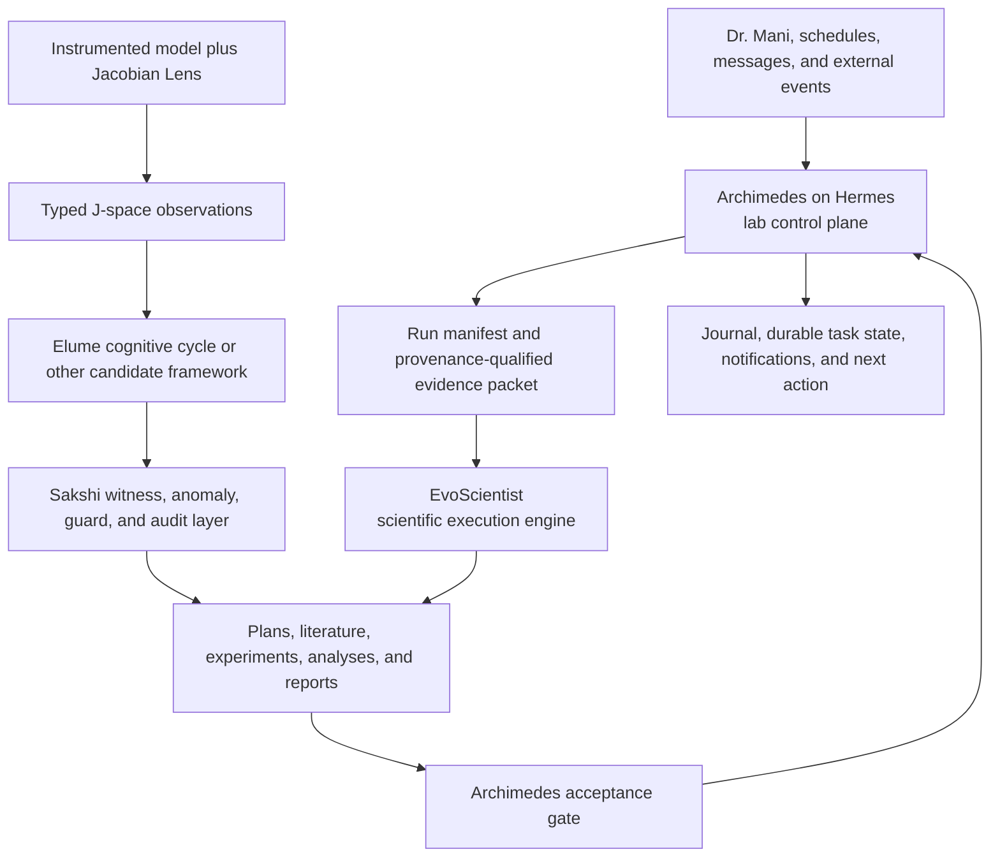

# Archimedes Cognitive Lab Architecture

- Status: Working architecture baseline
- J-lens integration: In progress; installation and runtime verification are
  not established by this document
- Scientific status: Experimental; no claim of phenomenal consciousness

## Purpose

Archimedes is intended to operate Dr. Mani's cognitive laboratory. EvoScientist
is embedded as the scientific execution engine, while Hermes provides the
durable operating layer around it. Anthropic's Jacobian Lens (J-lens) adds an
instrumentation layer for observing and intervening on internal model
representations so that consciousness frameworks can be translated into
falsifiable experiments.

The central separation is:

> Hermes runs the lab. EvoScientist runs the scientific process. J-lens observes
> and perturbs internal cognition. Elume instantiates candidate cognitive
> mechanisms. Sakshi protects the epistemic record.

This separation is about authority and evidence, not merely adding more agents.
EvoScientist already supplies multi-agent planning, research, implementation,
analysis, writing, memory, skills, scheduled work, channels, and human approval.
Hermes supplies the outer control loop that decides what work should happen,
under which constraints, whether it actually completed, whether its evidence is
acceptable, and what happens next.

## System roles

| Component | Primary role | Owns | Does not own |
|---|---|---|---|
| Dr. Mani | Principal investigator | Scientific intent, framework meaning, consequential approvals, publication decisions | Routine process supervision |
| Archimedes on Hermes | Lab director and control plane | Intake, portfolio priorities, task routing, permissions, budgets, run supervision, acceptance gates, institutional memory, delivery | Primary scientific analysis or self-approval of evidence |
| EvoScientist | Scientific execution engine | Experimental planning, literature research, hypothesis generation, implementation, analysis, skeptical evaluation, reports | Lab policy, publication authority, or final acceptance of its own work |
| Jacobian Lens / J-space adapter | Measurement and intervention instrument | Model-internal readouts, fitted-lens identity, layer/position measurements, causal interventions | Scientific interpretation or consciousness claims |
| Elume | Candidate cognitive substrate | Observation-driven cognitive cycles and formalized candidate mechanisms | Provenance authority or independent validation |
| Sakshi | Witness, guard, and audit layer | Evidence lineage, anomaly recording, expectation checks, protocol compliance, replay support | Primary hypothesis generation |
| Memory systems and experimental repositories | Instruments and research substrates | Domain-specific data, mechanisms, traces, and experimental outputs | Whole-lab orchestration |

## Operating architecture

The current cross-context hypothesis is therefore:

`instrumented model / environment -> typed observation seam -> candidate
cognitive mechanism -> witness and audit -> replayable evidence -> EvoScientist
hypothesis evaluation -> Archimedes acceptance gate -> bounded intervention`

## Why Hermes drives EvoScientist

Hermes does not need to duplicate EvoScientist's internal scientific team. Its
value comes from functions that must sit outside a scientific run.

### Durable laboratory agenda

EvoScientist can plan an experiment. Archimedes must maintain the larger
portfolio: hypotheses awaiting evidence, dependencies, blocked work,
replications, follow-up studies, rejected directions, costs, and human
decisions. The Hermes task ledger should be canonical; EvoScientist plans are
subordinate run plans.

### Independent supervision and acceptance

EvoScientist should not be the sole authority judging whether EvoScientist
succeeded. Archimedes must reconcile process state, the event stream, output
artifacts, checksums, validation results, and explicit gaps before accepting a
run.

This distinction has already mattered in practice. During the July 16, 2026
episodic-memory investigation, wrapper completion signals failed while
EvoScientist workers still produced a substantive research package. Archimedes
found the artifacts, read the authoritative report, verified its identity and
coverage, and kept EvoScientist's source claims separate from facts Archimedes
had independently checked.

### Cross-system routing

Archimedes decides whether a task belongs to EvoScientist, J-lens
instrumentation, Elume, Sakshi, an engineering specialist, or a skeptical
reviewer. EvoScientist remains a powerful scientific instrument rather than
being forced to impersonate the entire institution.

### Governance and safety

Archimedes owns source boundaries, approvals, resource ceilings, external
side effects, publication gates, and escalation. EvoScientist receives a
bounded research contract. The outer layer may start, stop, rescope, split,
retry, or reject a run without silently changing the scientific objective.

### Institutional memory

Hermes memory should preserve Dr. Mani's preferences, lab policy, decisions,
portfolio state, and the reasons projects were started, changed, or stopped.
EvoScientist memory should preserve scientific observations, methods, and
reusable research procedures. Findings should move from scientific memory into
lab-level truth only after review.

### Persistent human interface

Archimedes is the front door across interactive sessions, schedules, messaging,
and external events. It may triage routine work itself and invoke EvoScientist
only when the task requires a full scientific lifecycle.

## EvoScientist driver contract

EvoScientist's [`stream-json`](stream-json.md) protocol is the preferred
programmatic integration surface. It emits native tool, subagent, usage,
interrupt, error, and completion events for a headless client.

A durable investigation should use EvoScientist as an external worker or task
lane, not as a short-lived child whose lifetime is tied to one Hermes turn.

### Launch record

Before launch, Archimedes should record at least:

- lab task and hypothesis identifiers;
- exact research objective and acceptance criteria;
- prompt and source-packet hashes;
- source locations, access rules, and prohibited paths;
- EvoScientist thread or run identifier;
- model and provider configuration;
- workspace and output directory;
- time, cost, concurrency, and compute ceilings;
- mutation, credential, publication, and external-service permissions;
- expected artifacts and required validation.

### Event handling

The driver should:

- parse stdout as JSONL and treat stderr as operational logs;
- record recognized events while tolerating forward-compatible unknown types;
- correlate tool calls and results by identifier;
- track subagent start and completion independently;
- surface approval and clarification events to the correct authority;
- treat `done.response` as the authoritative final text, but not as sufficient
  evidence that the scientific task passed;
- reconcile missing or contradictory completion signals against process state,
  persisted thread state, and materialized artifacts before retrying.

### Acceptance gate

A run is accepted only when its task-specific conditions pass. Typical checks
include:

- expected artifacts exist and are nonempty;
- artifact manifest, sizes, hashes, and provenance are recorded;
- required sources have verified access method and coverage;
- reported commands, parameters, and environments are reproducible;
- behavioral and statistical checks have actually run;
- unsupported claims, limitations, and unresolved gaps are explicit;
- consequential interpretations have received independent skeptical or Sakshi
  review.

## Jacobian Lens and J-space

### Terminology

J-space is not a package installed into Archimedes, Hermes, or EvoScientist. It
is Anthropic's name for a model-internal subspace identified using the Jacobian
Lens. The installable component is the open-source J-lens reference
implementation and any compatible fitted lenses.

The J-lens transports an internal residual-stream vector into the model's
final-layer basis using an average input-output Jacobian, then decodes the
result with the model's own vocabulary unembedding. Its readout estimates what
an internal activation is disposed to make the model verbalize later.

### Access requirements

The public reference implementation targets open-weight Hugging Face decoder
models and uses Qwen in its examples. It requires direct activation and
backward-pass access to the measured model. Ordinary hosted-model API access is
not sufficient for fitting or applying this method because hosted APIs do not
expose the required internal activations and gradients.

The reference repository bundles neither model weights nor text corpora and is
marked by Anthropic as a reference implementation that is not maintained.
Model, lens, tokenizer, numerical backend, and hardware compatibility must
therefore be verified rather than assumed.

Applying Anthropic's method to an open-weight model tests the method and Dr.
Mani's framework on that model. It does not establish that the measured model
has the same internal organization reported for Claude.

### What J-space evidence can test

J-space instrumentation creates evidence below ordinary model output. Candidate
questions include:

- Does an unspoken concept become available for later report?
- Can the model deliberately activate, sustain, or suppress the representation?
- Does the representation causally mediate multi-step reasoning?
- Can one representation be reused by several downstream tasks?
- Is workspace access selective or capacity-limited?
- Do intermediate assessments, self-monitoring, evaluation awareness, or hidden
  goals appear internally without being verbalized?
- Do interventions predicted by a consciousness framework alter later reasoning
  and behavior in the predicted direction?

### Scientific boundary

Anthropic's experiments concern functional properties associated with access
consciousness: reportability, directed modulation, deliberate reasoning,
flexible use, and selective access. They do not show that a model has subjective
experience, feelings, or phenomenal consciousness.

Archimedes must preserve the following distinction in every report:

- **Observed:** a measured activation, readout, intervention, or behavioral
  effect under a specified protocol.
- **Supported inference:** a functional construct such as global availability,
  reportability, or causal mediation that survived its controls.
- **Unresolved interpretation:** whether that construct is sufficient for or
  related to phenomenal consciousness.

## Typed observation seam

J-space data should enter the wider cognitive system through an immutable,
typed observation rather than by adding model-instrumentation dependencies to
Sakshi or converting raw activations into narrative memory.

A candidate observation record includes:

| Field | Purpose |
|---|---|
| `observation_id` | Stable identity for replay and citation |
| `framework_hypothesis_id` | Prediction being tested |
| `model_id` and `checkpoint_hash` | Exact measured model identity |
| `tokenizer_id` | Vocabulary and tokenization identity |
| `lens_version` and `lens_hash` | Exact fitted-lens identity |
| `input_hash` and source reference | Exact stimulus without duplicating restricted content |
| `layer`, `position`, and token span | Measurement location |
| `readout` | Sparse ranked concepts and scores |
| `intervention` | Ablation, addition, swap, or control operation |
| `seed` and decoding parameters | Replay controls |
| `numerical_backend` | Framework, precision, device, and relevant library versions |
| `uncertainty` | Stability, calibration, or confidence information |
| `artifact_refs` | Content-addressed raw and derived evidence |
| `created_at` | Observation time |

Raw activations should remain outside ordinary agent memories and reports.
Sparse summaries, transformation receipts, and content-addressed references can
enter the evidence system while preserving the numerical artifacts required for
reanalysis.

## Experimental contract for consciousness frameworks

Each framework construct should be converted into a preregistered, falsifiable
experiment.

1. Define the construct in operational language.
2. State the predicted J-space and behavioral signature before collecting data.
3. Name plausible alternative explanations.
4. Specify model, task, layer, position, lens, and sampling conditions.
5. Include behavioral, observational, ablation, and representation-swap
   conditions where applicable.
6. Compare against random-vector, non-J-space, logit-lens, prompt-only, and
   output-only baselines as appropriate.
7. Predefine success, ambiguity, failure, and kill criteria.
8. Preserve all typed observations and transformation provenance.
9. Blind EvoScientist or downstream evaluators to condition labels where
   practical.
10. Route consequential interpretations through Sakshi and an independent
    skeptical review before Archimedes accepts them.

The model generating experimental conditions should be separated from the
measured model and the final evaluator where practical. If one model occupies
multiple roles, the report must identify the resulting dependence and leakage
risk.

## Initial experimental program

### 1. Measurement reproduction

Goal: establish that the installed model/lens pair produces stable, replayable
readouts before testing a consciousness framework.

Minimum evidence:

- environment and compatibility preflight;
- known-example reproduction;
- repeated-run stability;
- random and non-J-space controls;
- artifact and observation provenance;
- explicit deviations from Anthropic's reference setup.

### 2. Reportability versus internal availability

Goal: test whether J-space content predicts later report better than ordinary
activation magnitude, output logits, or prompt content.

### 3. Causal mediation of deliberate reasoning

Goal: determine whether ablating or swapping a candidate representation changes
an intermediate inference and the downstream answer in a framework-predicted
way.

### 4. Broadcast and flexible reuse

Goal: test whether one representation is consumed by several distinct
downstream operations rather than being a task-specific correlate.

### 5. Capacity, competition, and access

Goal: test framework predictions about limited workspace capacity, competition
between candidate contents, and the conditions governing entry.

### 6. Self-monitoring and evaluation awareness

Goal: examine whether internal recognition of evaluation, error, conflict, or
self-relevant state predicts behavior and survives adversarial controls. These
signals must not be treated as proof of subjective experience.

## Authority boundaries

- Hermes owns the lab task ledger; EvoScientist owns only run-local plans.
- Hermes schedules lab-level work; EvoScientist schedules internal scientific
  work within an authorized investigation.
- Hermes retains lab policy and portfolio memory; EvoScientist retains
  scientific observations and procedures.
- J-lens produces measurements; it does not interpret consciousness.
- Elume may instantiate a candidate theory; it does not validate itself.
- Sakshi records and checks evidence; it does not decide scientific meaning.
- Archimedes may reject or request replication of EvoScientist's conclusion.
- Only Dr. Mani authorizes publication, consequential intervention, and changes
  to the meaning of his frameworks.

## Current evidence and unresolved work

Established from the current repository:

- EvoScientist exposes a programmatic native event stream for an external
  runtime.
- EvoScientist already contains scientific subagents, memory, scheduling,
  channels, and approval surfaces.
- Prior Archimedes operation demonstrated the need to separate wrapper state
  from actual artifact completion.
- The current cognitive-lab intake already proposes typed J-space observations,
  Elume as a cognitive substrate, Sakshi as the witness layer, EvoScientist as
  scientific operator, and Archimedes as orchestrator and verifier.

Not established by this document:

- that the J-lens repository is installed correctly in the target environment;
- that a compatible model and fitted lens have been selected and verified;
- that GPU, precision, and dependency requirements are satisfied;
- that Anthropic's results reproduce on the selected open-weight model;
- that any of Dr. Mani's consciousness frameworks are supported or falsified;
- that J-space evidence establishes phenomenal consciousness.

## References

- [Anthropic: A global workspace in language models](https://www.anthropic.com/research/global-workspace)
- [Verbalizable Representations Form a Global Workspace in Language Models](https://transformer-circuits.pub/2026/workspace/index.html)
- [Anthropic Jacobian Lens reference implementation](https://github.com/anthropics/jacobian-lens)
- [EvoScientist stream-json protocol](stream-json.md)
- [Cognitive hypothesis lab context intake](../runs/cognitive-hypothesis-lab/context-intake-2026-07-16.md)
- [Archimedes operations journal, July 16, 2026](../journals/archimedes/2026-07-16.md)
- [Hermes Agent profiles](https://hermes-agent.nousresearch.com/docs/user-guide/profiles/)
- [Hermes Agent Kanban](https://hermes-agent.nousresearch.com/docs/user-guide/features/kanban)
- [Hermes Agent persistent memory](https://hermes-agent.nousresearch.com/docs/user-guide/features/memory)
- [Hermes Agent security](https://hermes-agent.nousresearch.com/docs/user-guide/security)
